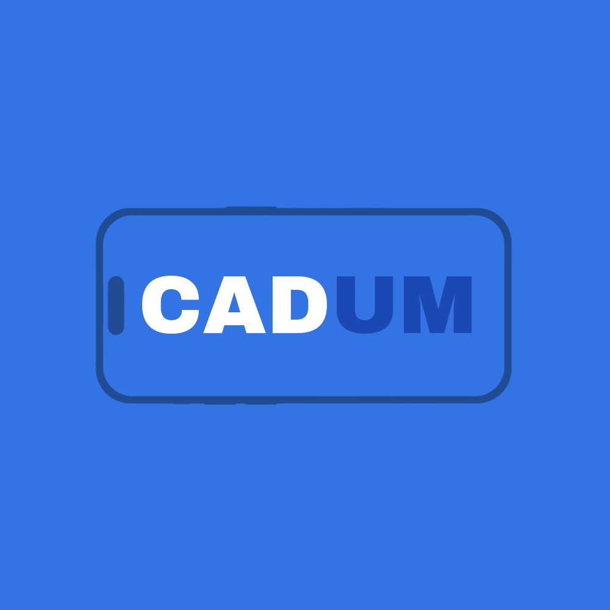

# CADUM - Club d'Application et de Développement à l'Université de Montréal

  
  
  
  
  

## 🎯 À propos

**CADUM** (Club d'Application et de Développement à l'Université de Montréal) est un club étudiant de développement d'applications mobiles fondé à l'automne 2024. Nous rassemblons des étudiants passionnés par le développement mobile qui souhaitent apprendre, créer et collaborer sur des projets concrets.

### 🎨 Notre mission
- Développer des compétences pratiques en développement d'applications mobiles
- Créer des projets innovants qui répondent aux besoins de la communauté universitaire
- Favoriser l'apprentissage collaboratif et le partage de connaissances
- Construire un portfolio de projets concrets pour nos membres

## 🚀 Projet en vedette

### 📱 Café sans-fil Mobile
**Notre projet phare actuellement en développement**

Extension mobile du projet Café sans-fil pour améliorer l'expérience des étudiants dans les cafés du campus. Une plateforme complète pour la découverte, commande et gestion des cafés étudiants de l'UdeM.

**Fonctionnalités principales :**
- Découverte et recherche des cafés du campus
- Passage et suivi de commandes en temps réel
- Gestion de profil et historique des commandes
- Notifications pour commandes et promotions

[🔗 **Voir le projet**](https://github.com/CADUM-UdeM/Cafe-sans-fil-mobile)

## 🛠️ Technologies

Stack technique moderne pour le développement mobile :
- **Mobile** : React Native, Expo, TypeScript
- **Backend** : API REST intégrée au projet principal
- **Outils** : Git, GitHub

## 👥 Rejoindre CADUM

### Qui peut participer ?
- Étudiants de l'Université de Montréal
- Tous niveaux d'expérience bienvenus
- Passion pour le développement mobile
- Envie d'apprendre et de collaborer

### Comment nous rejoindre ?
1. Rejoignez notre [Discord](https://discord.gg/DvJWz9hwWF) pour recevoir les annonces et participer aux séances hebdomadaires
2. Visitez notre [site web](https://cadum.aediroum.ca) pour plus d'informations
3. Participez à nos événements et ateliers
4. Rejoignez nos projets open source

## 📊 Nos statistiques

  

## 📅 Fondé en 2024

CADUM a été créé à l'automne 2024 avec la vision de rassembler les développeurs mobiles de l'UdeM et de créer un écosystème d'apprentissage et d'innovation.

## 🤝 Contribuer

Nous encourageons les contributions de tous les membres de la communauté ! Consultez nos repos pour voir comment vous pouvez participer à nos projets.

## 📞 Contact

- 🌐 **Site web** : [cadum.aediroum.ca](https://cadum.aediroum.ca)
- 💻 **GitHub** : [@CADUM-UdeM](https://github.com/CADUM-UdeM)
- 💬 **Discord** : [Rejoindre notre serveur](https://discord.gg/DvJWz9hwWF)

---

  <strong>Développé avec ❤️ par les étudiants de l'Université de Montréal</strong>

